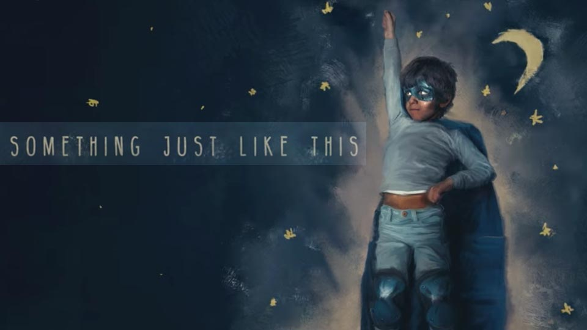

# Music_Genre_Classification

Music Genre Classification with Deep Learning.

# Datasets

Finding the right dataset was very difficult. At first, he tried to get a music file from [FreeSound](freesound.org) but it failed to only pick up music files from several files. Second, I tried [FMA Dataset](https://github.com/mdeff/fma) but the download speed was so slow that I found another way. Finally I used [GTZAN](http://marsyasweb.appspot.com/download/data_sets/). This dataset was a little small, but it had accurate data.

I classified thest genres :
  1.  blues 
  2.  classical 
  3.  country 
  4.  disco  
  5.  hiphop 
  6.  jazz 
  7.  metal 
  8.  pop 
  9.  reggae 
  10. rock 

# Result

I got only 40% accuracy, but I was able to achieve great results by dividing the music by 30 seconds.

 
